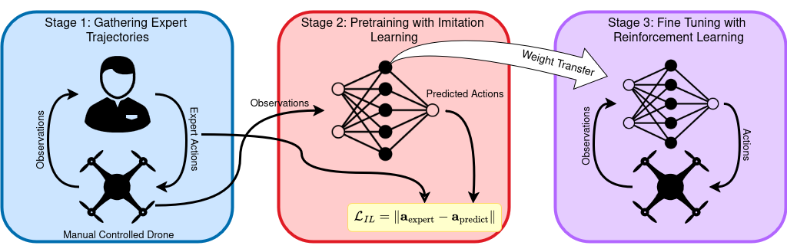

# IL with RL hybrid for UAV Autonomous Indoor Exploration

## Overview
This repository contains the software developed to enable autonomous indoor exploration with Unmanned Aerial Vehicles (UAVs) using a hybrid Deep Reinforcement Learning (DRL) and Imitation Learning (IL) approach. The system uses Behavior Cloning (BC) to pretrain the UAV from expert demonstrations and then fine-tunes the policy with the Soft Actor-Critic (SAC) DRL algorithm for continuous control. Training and testing are performed in NVIDIA Isaac Sim, a physics-accurate, photorealistic simulator.

The figure below illustrates the methodology designed in this work.

Experiments demonstrate that the hybrid IL+DRL approach converges faster and achieves higher coverage and success rates compared to policies trained with only DRL or IL.

This project is part of a Master’s thesis in Robotics, titled "Pretraining Deep Reinforcement Learning with Imitation Learning for Autonomous UAV Exploration in Unknown Indoor Environments," and is available in the [University of Twente repository](https://purl.utwente.nl/essays/108614).



## Folder structure
This repository contains several important directories:

- **`imitation_learning/`** – Contains Python scripts for training imitation learning (IL) algorithms:
  - `IL_train.py` – Trains the IL algorithm using expert demonstrations.
  - `demo_dataset_loader.py` – Loads expert trajectories and feeds them to IL training.
  - `model/` – Defines the neural network architecture used in IL, matching the layers and nodes of the SAC networks used in RL.

- **`isaac45/`** – Contains the main scripts for training and evaluating RL algorithms in Isaac Lab. The folder name is kept for compatibility, but the code has been adapted for Isaac Sim 5.1 and Isaac Lab 2.3.2:
  - **Main scripts:**
    - `train_exploration.py` – Script to train RL exploration policies.
    - `validate_exploration.py` – Script to evaluate trained IL and RL policies.
  - **Supporting directories required by the scripts:**
    - `RL_drone/` – Environment and agent configurations for training/testing RL algorithms.
    - `drone_models/` – Python configuration files and USD models of drones used in Isaac Lab.
    - `environments/` – USD files of training and testing environments.
    - `mdp/` – Implementation of **MDP components**, including rewards, termination conditions, events, observations, and actions.
    - `utils/` – Utility scripts for RL, including SB3 wrappers for Isaac Lab, RL architectures, and an occupancy map module.

- **`exploration_stack/`** – Four-layer research architecture for the next no-demo exploration direction:
  - robot adapters,
  - SLAM and mapping interfaces,
  - semantic VLM/LLM/heuristic frontier priors,
  - hierarchical global-local planning,
  - dependency-free smoke-test implementations.

- **`trained_model_and_trajectories/`** – Contains all trained IL and RL models as well as expert trajectories.


## Setup

### Dependencies
- Isaac Sim 5.1.0
- Isaac Lab 2.3.2
- Python 3.11 conda environment for Isaac Lab
- Project Python dependencies in `requirements.txt`

### Environment Setting
The current setup is conda-based. The repository can be cloned anywhere; the scripts resolve their own USD and output paths.

Clone IsaacLab and use the release corresponding to Isaac Lab 2.3.2:
```sh
git clone https://github.com/isaac-sim/IsaacLab.git
cd IsaacLab/
git checkout v2.3.2
```

Create or activate the Isaac Lab conda environment:
```sh
./isaaclab.sh -c env_isaaclab
conda activate env_isaaclab
./isaaclab.sh -i
```

Install this project's extra dependencies:
```sh
cd /home/bavantha/Autonomous_Drone
python -m pip install -r requirements.txt
```

## Four-layer exploration stack
The current IL/SAC training path is preserved. A new parallel architecture has
been added for future no-imitation-learning exploration work:

```sh
python scripts/run_four_layer_smoke_test.py --steps 5
python -m unittest discover -s tests
```

The smoke test uses mocked robot/SLAM/map providers and does not require Isaac
Sim, ROS 2, or a VLM. See `docs/four_layer_architecture.md` for the layer
interfaces, data flow, config files, stubs, and next implementation steps.

If you need the tracked model/checkpoint files, install Git LFS before cloning:
```sh
git lfs install
git clone https://github.com/BavanthaU/DRL_UAV_Indoor_Exploration.git
```

## ⚙️ Usage
### Train IL algorithm with Behavior Cloning
To train IL algorithm run:
```sh
cd /home/bavantha/Autonomous_Drone
conda activate env_isaaclab
python -m imitation_learning.IL_train --max_iters 1000
```
Use `--demo_dir` if your expert demonstrations are outside `trained_model_and_trajectories/expert_trajectories/`.


### Train RL algorithms with SAC with or without pretraining.
The GUI can be visualized through the Isaac Sim WebRTC Streaming Client by adding `--livestream=2` instead of `--headless`. The streaming client has to be connected through the IP address. Type `hostname -I` in terminal to get the IP address.


**With IL pretraining and filling replay buffer**. 
Use an absolute path to the script so it works even when the repo is outside the IsaacLab checkout.
```sh
conda activate env_isaaclab
CUDA_VISIBLE_DEVICES=0 python /home/bavantha/Autonomous_Drone/isaac45/train_exploration.py \
  --enable_cameras \
  --num_envs 10 \
  --headless \
  --task Drone_SAC_IL_V1 \
  --use_IL \
  --fill_replay_buffer \
  --IL_model_path /home/bavantha/Autonomous_Drone/trained_model_and_trajectories/IL_models_observations/BC_O4.pth
```
Depending on your file structure, the `IL_model_path` argument might need a different value.

**With IL pretraining, buffer already exists**
```sh
conda activate env_isaaclab
CUDA_VISIBLE_DEVICES=0 python /home/bavantha/Autonomous_Drone/isaac45/train_exploration.py \
  --enable_cameras \
  --num_envs 10 \
  --headless \
  --task Drone_SAC_IL_V1 \
  --use_IL \
  --IL_model_path /home/bavantha/Autonomous_Drone/trained_model_and_trajectories/IL_models_observations/BC_O4.pth \
  --buffer_path logs/sb3/replay_buffer_widelens.pkl
```

**Without IL pretraining (SAC only)** 
```sh
conda activate env_isaaclab
CUDA_VISIBLE_DEVICES=0 python /home/bavantha/Autonomous_Drone/isaac45/train_exploration.py \
  --enable_cameras \
  --num_envs 10 \
  --headless \
  --task Drone_SAC_no_IL_V1 \
  --wandb_mode disabled
```

### Evaluate IL or RL Policies
You can evaluate trained IL or RL policies in different environments. Change the `--task` flag to select the environment you want to evaluate in: `envA`, `envB`, or `envC`.
```sh
conda activate env_isaaclab
CUDA_VISIBLE_DEVICES=0 python /home/bavantha/Autonomous_Drone/isaac45/validate_exploration.py \
  --enable_cameras \
  --num_envs 1 \
  --headless \
  --task Drone_eval_envA \
  --checkpoint /home/bavantha/Autonomous_Drone/trained_model_and_trajectories/RL_models/BC_SAC.zip
```


## Logging during training
Training logs are recorded using TensorBoard. To view them on your local machine while running training on a remote server, follow these steps:

Create an SSH tunnel from your machine to the server:
```sh
ssh -L 6006:localhost:6006 <username>@<servername>
```
Activate the conda environment:
```sh
conda activate env_isaaclab
```
Launch TensorBoard inside the container:
```sh
tensorboard --logdir ./logs --host localhost --port 6006
```
Open the browser on your local PC and go to:
```sh
http://localhost:6006
```
A different port other than 6006 can be used, if that one is already in use. 
